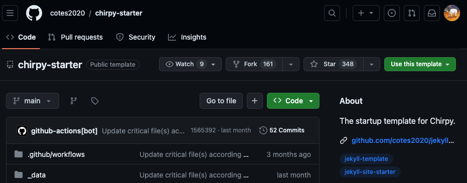
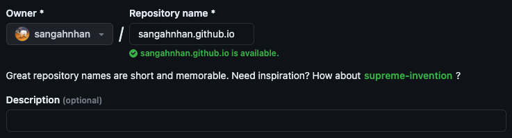
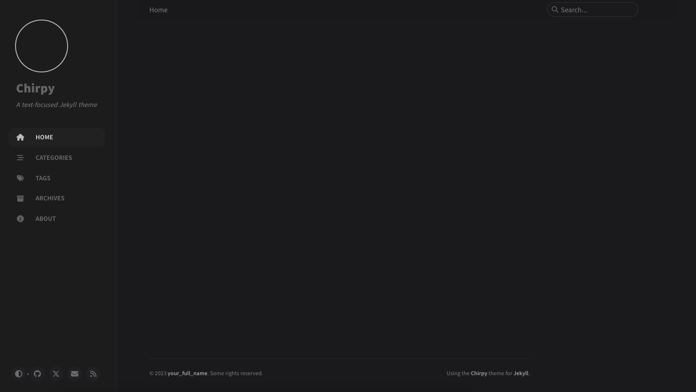

Jekyll-theme중 하나인 chirpy 테마로 블로그를 만들어 볼 것이다

[jekyll-theme-chirpy](https://github.com/cotes2020/jekyll-theme-chirpy)

## Supported macOS version (2024/1/1 기준)
- Ventura(macOS 13)
- Montery(macOS 12)
- Big Sur(macOS 11)

## 사전준비
사전준비는 Jekyll을 설치하기 위해 필요한 과정이다(이미 다음과정을 마쳤다면 넘어가도 좋다)
- Homebrew 설치
- chruby와 최신버전 Ruby 설치
- Jekyll 설치

### Homebrew 설치
```
/bin/bash -c "$(curl -fsSL https://raw.githubusercontent.com/Homebrew/install/HEAD/install.sh)"
```

### chruby 설치
```
brew install chruby ruby-install xz
```
#### 에러 
여기서 다음과 같은 에러가 났다
```
Error: Cannot install under Rosetta 2 in ARM default prefix (/opt/homebrew)!
To rerun under ARM use:
    arch -arm64 brew install ...
To install under x86_64, install Homebrew into /usr/local.
```
#### 해결
.zshrc에 들어가고
```
$ vi ~/.zshrc
```

.zshrc 아래에 다음을 추가한다
```
export PATH="/usr/local/bin:$PATH"

alias mbrew="arch -arm64e /opt/homebrew/bin/brew"
```

나올 때 esc키를 누르고 :wq! 로 저장하고 나온다. 그리고 나온 후 .zshrc 수정사항 반영한다
```
$ source ~/.zshrc
```

그리고 아래 실행하면 된다
```
mbrew install chruby ruby-install xz
```
### 최신버전 Ruby 설치
```
ruby-install ruby 3.1.3
```

```
echo "source $(brew --prefix)/opt/chruby/share/chruby/chruby.sh" >> ~/.zshrc
echo "source $(brew --prefix)/opt/chruby/share/chruby/auto.sh" >> ~/.zshrc
echo "chruby ruby-3.1.3" >> ~/.zshrc # run 'chruby' to see actual version
```

#### 에러
```
/Users/hansang-ahn/.zshrc:source:141: no such file or directory: /usr/local/opt/chruby/share/chruby/chruby.sh
/Users/hansang-ahn/.zshrc:source:142: no such file or directory: /usr/local/opt/chruby/share/chruby/auto.sh
/Users/hansang-ahn/.zshrc:143: command not found: chruby
```
#### 해결
터미널에서 chruby 디렉토리를 root에서부터 찾아서 직접 chruby.sh와 auto.sh가 있는 경로를 찾는다.
```
$ sudo find / -type d -name "chruby"
```
내 경우에는 다음의 위치에 있었다
```jsx
/opt/homebrew/Cellar/chruby/0.3.9/share/chruby
```

### Jekyll 설치

```jsx
$ gem install jekyll
```

## Chirpy 테마 사용해서 블로그 만들기

화면의 우측에 초록색 Use the template 클릭


본인이름 뒤에 `.github.io` 붙이면 된다



그 후에 조금 기다린 다음에 주소창에 [sangahnhan.github.io](http://sangahnhan.github.io) 를 입력하면 블로그 생성이 완료된걸 볼 수 있다
sangahnhan 에서 본인 깃허브 아이디로 바꾸면 된다

